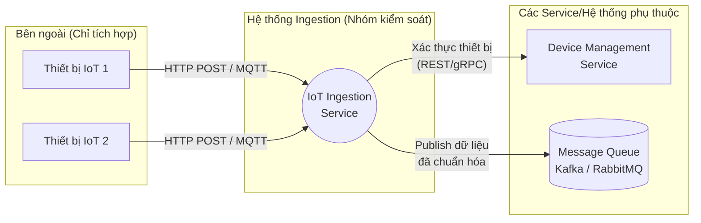

# Service Boundary của nhóm

## 1. Thông tin nhóm

- Tên nhóm: IoT Ingestion
- Lớp: CNTT 17-10
- Thành viên:
    - Vương Thị Ngọc Ánh
    - Đàm Vĩnh Hưng
    - Nguyễn Lê Đăng Khánh
- Service nhóm phụ trách: IoT Ingestion
- Sản phẩm tổng thể của lớp: Xây dựng dịch vụ tiếp nhận dữ liệu IoT.

## 2. Actor

- **Thiết bị IoT (IoT Devices / Sensors):** Nguồn phát sinh dữ liệu, liên tục gửi dữ liệu (telemetry) như nhiệt độ, độ ẩm, vị trí... về hệ thống.
- **Hệ thống Monitor/Admin:** Giám sát tình trạng hoạt động (health, throughput, latency) của Ingestion Service.

## 3. System Boundary

Nhóm em xây phần nào?
- Xây dựng **Ingestion Service** (dưới dạng REST API hoặc tích hợp MQTT Broker) làm cổng giao tiếp để tiếp nhận luồng dữ liệu lớn từ các thiết bị IoT.
- Viết logic xác thực thiết bị, kiểm tra tính hợp lệ của dữ liệu (validation) và định tuyến/chuyển tiếp dữ liệu đến Message Queue.

Phần nhóm kiểm soát:
- Mã nguồn và cấu hình hạ tầng của IoT Ingestion Service.
- Các API endpoints tiếp nhận dữ liệu từ bên ngoài.
- Định dạng (Schema) tiêu chuẩn của dữ liệu đầu vào.
- Cách xử lý lỗi (Error handling) khi dữ liệu sai định dạng hoặc thiết bị không hợp lệ/bị chặn.

Phần nhóm chỉ tích hợp:
- **Thiết bị IoT (Hardware/Firmware):** Chỉ nhận dữ liệu do các thiết bị (hoặc trình giả lập) gửi tới. Không can thiệp mã nguồn trên thiết bị.
- **Message Broker (Kafka / RabbitMQ / MQTT Broker):** Chỉ cấu hình kết nối để đẩy (publish) dữ liệu vào, không trực tiếp quản trị cluster hạ tầng này.
- **Device Management Service (nếu có):** Gọi API nội bộ để kiểm tra thiết bị có tồn tại và được phép gửi dữ liệu hay không.

## 4. Service Boundary

Service của nhóm có trách nhiệm gì?
- Tiếp nhận dữ liệu (telemetry) với lưu lượng lớn và tần suất cao từ các thiết bị IoT.
- Xác thực cơ bản thiết bị (kiểm tra API Key, Device Token, chữ ký bảo mật).
- Rà soát, chuẩn hóa và kiểm tra định dạng dữ liệu (Data Validation/Sanitization).
- Đẩy dữ liệu đã qua xử lý và hợp lệ vào Message Queue/Event Bus để các service phía sau tiêu thụ.
- Đảm bảo tính sẵn sàng cao (High Availability) và khả năng chịu tải (Scalability).

Service KHÔNG làm gì?
- Không lưu trữ dữ liệu lâu dài (chỉ xử lý luồng in-memory hoặc lưu tạm và đẩy đi).
- Không xử lý nghiệp vụ phức tạp (như tính toán trung bình, cảnh báo vượt ngưỡng, machine learning, phân tích dữ liệu).
- Không quản lý vòng đời của thiết bị (Provisioning, Cập nhật Firmware, cấu hình thiết bị).
- Không gửi thông báo/tin nhắn trực tiếp (Alerts/Notifications) đến người dùng cuối.

## 5. Input / Output

### Input
- **Dữ liệu thô (Raw Telemetry Data):** Các bản tin JSON, Protocol Buffers... từ thiết bị IoT. Ví dụ: `{"device_id": "sensor_01", "temperature": 30.5, "humidity": 70, "timestamp": 1715000000}`.
- **Thông tin xác thực:** Headers chứa API Key, Bearer Token hoặc các thông số xác thực qua giao thức MQTT.

### Output
- **Dữ liệu chuẩn hóa:** Bản tin đã được làm sạch và đóng gói theo chuẩn chung của hệ thống, sẵn sàng publish vào Message Queue (Ví dụ topic: `iot.telemetry.validated`).
- **Phản hồi trạng thái (HTTP/MQTT Response):** 
  - `200/202 OK/Accepted` (Đã nhận thành công).
  - `400 Bad Request` (Sai định dạng).
  - `401/403 Unauthorized` (Thiết bị chưa được cấp phép).

## 6. API dự kiến

| Method | Endpoint | Mục đích |
|---|---|---|
| GET | `/health` | Kiểm tra trạng thái hoạt động (health check) của service |
| POST | `/api/v1/telemetry` | Tiếp nhận một bản ghi dữ liệu telemetry từ thiết bị |
| POST | `/api/v1/telemetry/batch` | Tiếp nhận cùng lúc một mảng (batch) dữ liệu để tối ưu kết nối |

*(Lưu ý: Nếu hỗ trợ giao thức MQTT, hệ thống sẽ lắng nghe trên các Topic như `telemetry/{device_id}` thay vì API HTTP)*

## 7. Phụ thuộc service khác

Service này gọi đến service nào?
- **Device Management Service (tùy chọn):** Gọi để xác minh `device_id` hoặc Token có hợp lệ, có bị khóa hay không.
- **Message Queue/Broker Service:** Mở kết nối và gọi hàm publish để đẩy dữ liệu vào luồng (Topic/Queue).

Service nào gọi đến service này?
- Hầu như **không có service nào** trong nội bộ gọi đến Ingestion Service để gửi nghiệp vụ (chỉ có hệ thống Monitor định kỳ gọi `/health`). 
- Actor chính gọi đến service này là các **Thiết bị IoT** hoặc **IoT Gateway** bên ngoài ranh giới hệ thống.

## 8. Sơ đồ minh họa

